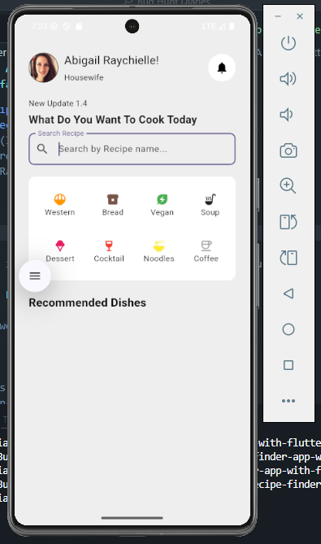

We all love cooking and trying out new recipes. But, have you ever found yourself stuck in the kitchen, wondering what to make for dinner? That's where a recipe finder app comes in handy. In this tutorial, we'll build a recipe finder app using Flutter, a popular cross-platform development framework.

In this tutorial, we'll walk through building a beautiful recipe finder application using Flutter. This app allows users to search for recipes, browse recommended dishes, and view detailed information about each recipe. Let's break down the code and architecture to understand how everything works together.


<!--  -->

## Project Overview

Our Recipe Finder app has several key components:

1. **Home Page**: Displays recommended recipes and search functionality
2. **Recipe Details Page**: Shows detailed information about a selected recipe
3. **API Service**: Handles communication with a recipe API
4. **Custom Widgets**: Reusable UI components for displaying food items

## Setting Up the Main Page

The `MyHomePage` class is our application's main screen, implemented as a `StatefulWidget` to manage dynamic content.

### Key State Variables

```dart
Set<Recipe?> savedBookmarks = <Recipe?>{};
List<Recipe>? _recipes;
bool _isearching = false;
bool _donesearching = true;
final TextEditingController _searchController = TextEditingController();
final apiService = ApiService();
```

- `savedBookmarks`: Tracks recipes the user has bookmarked
- `_recipes`: Stores the list of recipes to display
- `_isearching`/`_donesearching`: Manage search state UI
- `_searchController`: Controls the search input field
- `apiService`: Handles API communication

## Initializing the Page

```dart
@override
void initState() {
  super.initState();
  _loadRecipes();
  _searchController.clear();
}
```

When the page loads, we:

1. Fetch initial recipes with `_loadRecipes()`
2. Clear any existing search text

## Loading Recipes

```dart
void _loadRecipes() async {
  try {
    final recipes = await apiService.fetchallrecipe().timeout(
      const Duration(seconds: 30),
    );
    setState(() {
      _recipes = recipes;
    });
  } catch (e) {
    debugPrint('Error fetching recipes: $e');
    setState(() {
      _recipes = null;
    });
  }
}
```

This method:

1. Attempts to fetch all recipes with a 30-second timeout
2. Updates state with the results or handles errors gracefully

## Implementing Search Functionality

```dart
void _searchRecipe(String query) async {
  setState(() {
    _isearching = true;
    _donesearching = false;
  });

  final recipes = await apiService.searchRecipes(query);
  setState(() {
    _recipes = recipes;
    _isearching = false;
    _donesearching = true;
  });
}
```

The search flow:

1. Sets loading state
2. Calls API service with search query
3. Updates UI with results or empty state

## Building the User Interface

The `build` method creates our page layout with several key sections:

### 1. Header Section

```dart
Padding(
  padding: const EdgeInsets.all(25.0),
  child: Row(
    mainAxisAlignment: MainAxisAlignment.spaceBetween,
    children: [
      // User profile and info
      Row(/*...*/),
      // Notification icon
      Container(/*...*/),
    ],
  ),
),
```

Displays:

- User profile picture
- Name and role
- Notification bell icon

### 2. Search Bar

```dart
TextField(
  controller: _searchController,
  onSubmitted: _searchRecipe,
  decoration: InputDecoration(
    labelText: 'Search Recipe',
    hintText: 'Search by Recipe name...',
    prefixIcon: const Icon(Icons.search),
    border: OutlineInputBorder(
      borderRadius: BorderRadius.circular(10),
    ),
  ),
),
```

A clean, functional search input that triggers `_searchRecipe` on submit.

### 3. Food Category Quick Filters

When no search is active, we display a grid of food categories:

```dart
Container(
  padding: const EdgeInsets.all(12),
  decoration: BoxDecoration(
    color: Colors.white,
    borderRadius: BorderRadius.circular(12),
  ),
  child: Column(
    children: [
      Row(/* Western, Bread, Vegan, Soup */),
      SizedBox(height: 5),
      Row(/* Dessert, Cocktail, Noodles, Coffee */),
    ],
  ),
),
```

Each category uses our reusable `Foodscontainer` widget.

### 4. Recipe Grid View

The main content area displays recipes in a responsive grid:

```dart
GridView.builder(
  padding: const EdgeInsets.all(2),
  itemCount: _recipes == null ? foodData.length : _recipes!.length,
  shrinkWrap: true,
  physics: const NeverScrollableScrollPhysics(),
  gridDelegate: const SliverGridDelegateWithFixedCrossAxisCount(
    crossAxisCount: 2,
    crossAxisSpacing: 10,
    mainAxisSpacing: 10,
    childAspectRatio: 0.8,
  ),
  itemBuilder: (context, index) {
    // Builds each recipe card
  },
),
```

Key features:

- 2-column grid layout
- Uses mock data if API fails (`foodData`)
- Each item is a `FoodDetailsBox` widget
- Handles tap gestures with `_onFoodCardTapped`

## Navigation to Recipe Details

```dart
void _onFoodCardTapped(
  int id,
  String foodName,
  String foodImage,
  List<String> mealType,
) {
  Navigator.push(
    context,
    MaterialPageRoute(
      builder: (context) => FoodDetailsPage(
        foodid: id,
        foodName: foodName,
        foodImage: foodImage,
        mealType: mealType,
        savedBookmarks: savedBookmarks,
      ),
    ),
  );
}
```

This method navigates to the details page with all necessary recipe data.

## Project Structure

The complete codebase follows this organization:

```
lib/
├── models/
│   └── recipe_model.dart       # Recipe data model
├── pages/
│   ├── food_details_page.dart  # Recipe details screen
│   └── home_page.dart          # Main screen (this file)
├── repository/
│   └── api_service.dart        # API communication
└── utils/
    ├── fooddetailsbox.dart     # Recipe card widget
    └── foodscontainer.dart     # Category chip widget
```

## Best Practices Implemented

1. **Separation of Concerns**: API logic, UI, and models are properly separated
2. **State Management**: Uses setState for simple state needs
3. **Error Handling**: Gracefully handles API failures
4. **Reusable Components**: Custom widgets for consistent UI
5. **Responsive Design**: Works well on different screen sizes

## Extending the App

To enhance this app, consider:

1. Adding persistent bookmarks with shared_preferences
2. Implementing a favorites system
3. Adding recipe filtering by category
4. Improving error states with retry buttons
5. Adding pull-to-refresh functionality

## Conclusion

This tutorial walked through building a complete recipe finder app in Flutter. We covered:

- Setting up the main page with search functionality
- Fetching and displaying recipe data
- Creating reusable UI components
- Implementing navigation between screens
- Managing application state

The clean architecture and thoughtful widget composition make this app easy to maintain and extend. Try running this code and experiment with adding your own features!

Happy coding! 🚀
